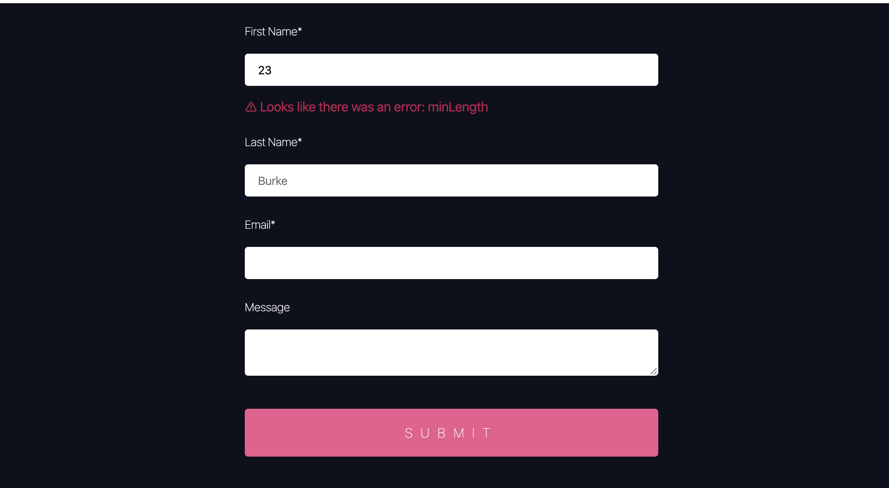

## Instructions and/or completion requirements (MVP)

In order to complete my mission for today, I will need to write tests to be confident in shipping this component. Below is a _general_ outline of how I accomplished this.

1. Find out what behaviors you expect, and any you don't expect. 
1. Write down on a piece of paper what you want to test. (This is a very important step - always plan before coding!)
1. Add my first test. This one should be a very simple test to make sure the testing setup is working.
1. Write a sufficient amount of tests to give you confidence in the project's code

_If I come across any "unexpected" behaviors in the form UI (not the test), I will try this flow:_

- [ ] You may have noticed that the form validation for one of the inputs is a little off...
- [ ] Write a test for the "expected" behavior (it will fail because something in the component is doing something unexpected)
- [ ] Confirm that the test fails, because of the "unexpected" behavior
- [ ] Look at the code in the project to find what is causing the behavior
- [ ] Fix the code so that your new test passes
- [ ] Celebrate that my test helped me find and fix a bug!
